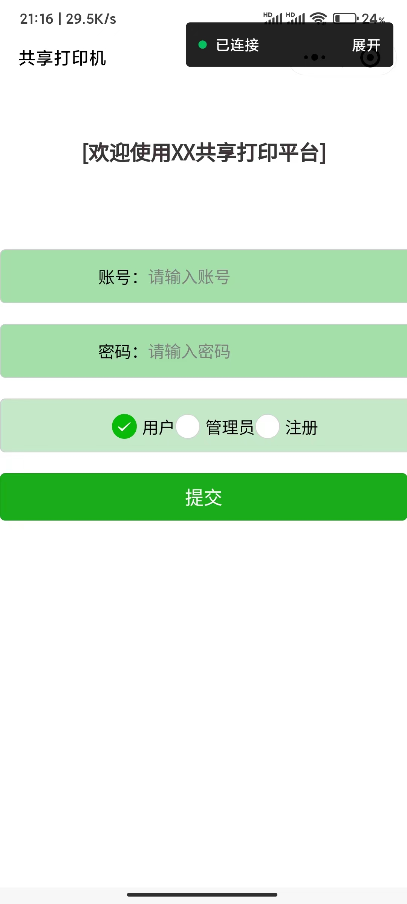
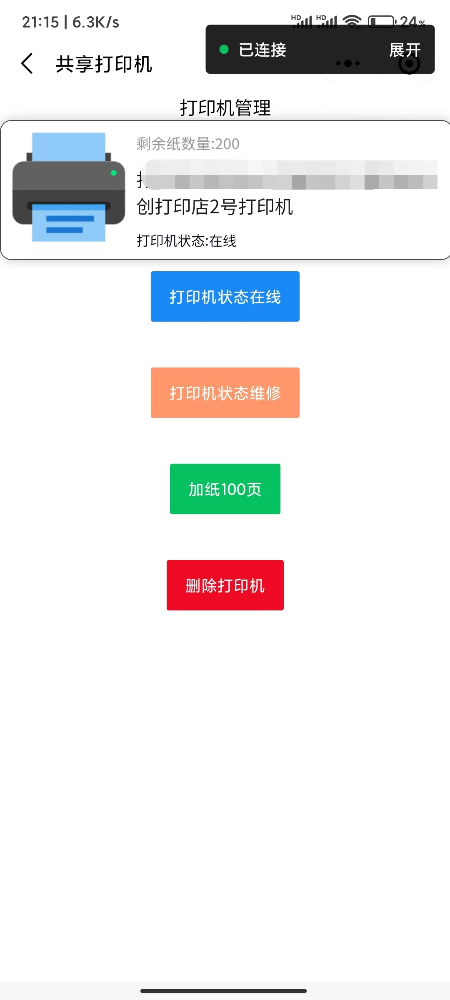
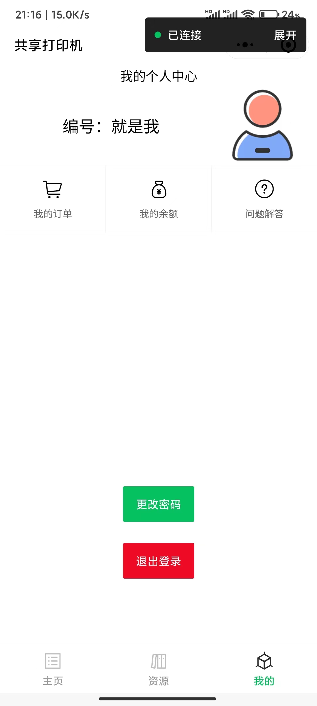
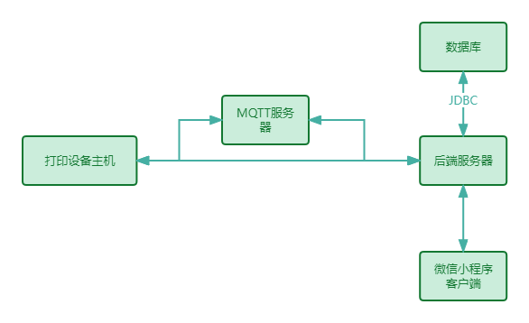
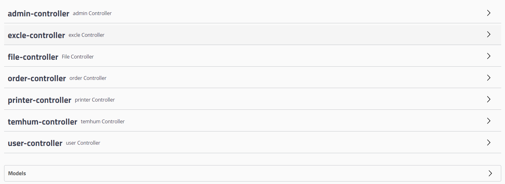

# SharePrinter(共享打印机)

### 简介

​         以传统共享打印机为基础，对原有打印机的共享打印方式以及需要人来接入服务等限制进行扩展，使其能够部署的范围更广，打印成本更低，可靠性与隐私性更高。该共享打印系统主要由以下三部分构成。在客户端:以微信小程序为平台，用户通过小程序界面，对需要进行的打印任务进行上传支付打印费用，由服务器端对用户任务打印任务及需求进行分配并下放给自助打印设备打印。共享打印系统的应用和成果包括场景扩展、成本降低、数据安全与隐私保护、用户体验改善、设备管理与运营效率提升以及市场影响与商业机会。通过这些应用和成果，可以实现对传统打印模式的改进，提供更便捷、高效和经济的打印服务，满足用户的需求，并为投资者和企业带来商业机会。  

​        软件：客户端和管理端使用微信小程序开发。微信小程序可以用户可以注册登录，上传打印文件打印、下载管理员上传的共享文件、充值、更改账户密码等；管理员端可以管理打印机进行参数调整，添加打印机，管理共享文件进行上传删除。后端使用的是Springboot+Mysql，后端与设备的通讯是使用的MQTT通讯。

​        实物：开发出了共享打印机的实物，后端可以下发指令并让设备工作，设备端代码使用的是Python编写。

### 效果展示

用户登录注册 管理员登录：



用户主页：


资源文件上传下载删除：



打印机管理：


用户中心：




# 文档目录介绍

 ```c
├─PysharedPrinter //设备代码
├─PysharedPrinterWeb //后端代码
├─SharedPrint  //小程序代码
 ```

## 整体架构





## 主要技术

MQTT：使用的是基于EMQX大家的MQTT服务器。[EMQX官网](https://www.emqx.com/zh)

Swagger：是一个用于设计、构建、文档化和测试 RESTful Web 服务的开源工具集。 [Swagger官网]( https://swagger.io/)

Vant Weapp组件库：小程序组件库。[Vant Weapp](https://vant-contrib.gitee.io/vant-weapp/#/home)

SpringBoot: 是一个用于构建独立、生产级的Spring应用程序的框架。它通过提供约定大于配置的方式，简化了Spring应用程序的开发和部署过程。Spring Boot提供了许多开箱即用的特性和功能，如自动配置、内嵌服务器、健康检查、安全性等，减少了开发者的配置工作，让开发者能够更专注于业务逻辑的实现。 [SpringBoot官网](https://spring.io/projects/spring-boot)

微信小程序： 微信小程序是一种全新的连接用户与服务的方式，它可以在微信内被便捷地获取和传播，同时具有出色的使用体验 。[微信小程序开发文档](https://developers.weixin.qq.com/miniprogram/introduction/)

## 项目部署

#### 运行环境

> 微信小小程序开发环境 

> 服务器 Java1.8 Linux 

> 设备端 乌班图20.0  py3.7

微信小程序导入  更改app.js文件服务器地址

```javascript
// app.js
App({
  onLaunch() {
    //判断用户是否登录
    let isLogin = wx.getStorageSync('isLogin')
    if (isLogin) {
      console.log("用户已登录")
      console.log(wx.getStorageSync('isLogin'))
      this.globalData.isLogin = true
      //判断用户是否是管理员
      let isAdmin = wx.getStorageSync('isAdmin')
      if (isAdmin) {
        console.log("用户是管理员")
        console.log(wx.getStorageSync('isAdmin'))
        this.globalData.isAdmin = true
      }
      //跳转到首页
      wx.switchTab({
        url: '/pages/index/index',
      })
    } else {
      console.log("用户未登录")
      console.log(wx.getStorageSync('isLogin'))
      this.globalData.isLogin = false
      //跳转到登录页面
      wx.redirectTo({
        url: '/pages/login/login',
      })
    }
  },
  //全局变量
  globalData: {
    isAdmin: false,
    isLogin: false,
    userInfo: "",
    //服务器地址
    serverUrl: 'http://1.1.1.1:8091'
    // serverUrl: 'http://localhost:8091'
  }
})

```

SpringBoot后端项目导入 更改配置文件MQTT服务器地址

```properties
spring.application.name=SharedPrinterWeb
server.port=8091
spring.datasource.type=com.alibaba.druid.pool.DruidDataSource
spring.datasource.driver-class-name=com.mysql.cj.jdbc.Driver
spring.datasource.url=jdbc:mysql://localhost:3306/shared_printer?characterEncoding=utf-8
spring.datasource.username=shared_printer
#spring.datasource.username=root
spring.datasource.password=123456
#--------MQTT---------------------------
#MQTT ID
mqtt.appid=mqtt_1_SharedPrinterWeb_001
#MQTT ID
mqtt.outAppId=mqtt_out_SharedPrinterWeb_001
mqtt.input.topic=SharedPrinterWeb
mqtt.out.topic=SharedPrinterWeb
mqtt.user=test
mqtt.password=123456
#MQTT
mqtt.services=tcp://1.1.1.1:1883

#upload file max size
spring.servlet.multipart.max-file-size=100MB
```

设备端代码 Python 更改请求地址 （这个代码写的有点乱 正常工作可能需要调试一下）

```python
#共享打印机的设备端
# 1. 从服务器端获取打印任务 使用的是MQTT协议 收到打印的指令
# 2. 打印任务
# 3. 打印完成后，将打印结果发送给服务器端
# 4. 服务器端接收到打印结果后，将打印结果发送给服务器
# 5. 删除文件

import paho.mqtt.client as mqtt
import os
import json
import random
import string

#{"printerid":"1","id":"1","Printnumber":"1","Printcolor":"1","Printfile":"1PrintcontentPrinttimePrintstatusPrintresult"}
#打印机ID 订单ID 份数 颜色1是黑白2是彩色 打印文件下载链接

# 订阅主题
TOPIC = "sharedprintDevice1"
# 服务器地址
HOST = "1.1.1.1"
# 端口号
PORT = 1883
# 设备ID
CLIENT_ID = "1"
#定义LInux下的文件缓存路径
FILE_PATH = "/home/sharedprint/file/"


#解析函数 解析{"id":"1","Printnumber":"1","Printcolor":"1","Printfile":"1PrintcontentPrinttimePrintstatusPrintresult"}
def parse_message(message):
    #解析json
    json_data = json.loads(message)
    #打印机ID
    id = json_data["printerid"]
    #订单ID
    order_id = json_data["id"]
    #打印份数
    print_number = json_data["Printnumber"]
    #打印颜色
    print_color = json_data["Printcolor"]
    #打印文件
    print_file = json_data["Printfile"]
    return id, order_id,print_number, print_color, print_file

#订阅MQTT
def on_connect(client, userdata, flags, rc):
    print("Connected with result code "+str(rc))
    client.subscribe(TOPIC)
    print("subscribe topic: " + TOPIC)

#接收消息
def on_message(client, userdata, msg):
    print("Received a message on topic: " + msg.topic)
    print("Received a message: " + str(msg.payload.decode("utf-8")))
    #打印文件
    print_file(str(msg.payload.decode("utf-8")))


#主函数
def main():
    # 创建MQTT客户端
    client = mqtt.Client(CLIENT_ID)
    # 连接MQTT服务器
    client.connect(HOST, PORT, 60)
    # 设置消息回调
    client.on_connect = on_connect
    client.on_message = on_message
    # 循环接收消息
    client.loop_forever()
    #设置遗嘱
    client.will_set("sharedprintDevice", "{\"type\":\"1\",\"id\":\"1\",\"status\":\"offline\"}", 2, False)
    #上线发送消息
    client.publish("sharedprintDevice", "{\"type\":\"1\",\"id\":\"1\",\"status\":\"online\"}", 2, False)
    #{"type":"1","id":"1","status":"online"}

#打印机打印文件
def print_file(print_msg):
    #解析json
    id, order_id, print_number, print_color, print_file = parse_message(print_msg)
    #判断是否本机id
    if id != CLIENT_ID:
        return False
    #下载文件 curl -X GET "http://1.1.1.1:8091/download?fileName=1684975934491.pdf" -H "accept: */*" 下载文件 保存
    file_name = ''.join(random.sample(string.ascii_letters + string.digits, 8)) + ".pdf"
    #下载文件
    os.system("curl -X GET \"http://1.1.1.1:1/download?fileName=" + print_file + "\" -H \"accept: */*\" > " + FILE_PATH + file_name)
    #打印并删除文件
    os.system("lpr -# " + print_number + " -r " + FILE_PATH + file_name)
    #延迟5秒 保证文件传输打印机完成
    # time.sleep(5)
    # 打印完成请求
    os.system(
        'curl -X GET "http://39.98.181.193:8091/updateorder?id='
        + order_id
        + '&state=已完成" -H "accept: */*"'
    )
    #删除服务器文件 curl -X GET "http://1.1.1.1:8091/deletefile?fileName=1684975934491.pdf" -H "accept: */*" 删除服务器文件
    os.system("curl -X GET \"http://1.1.1.1:8091/deletefile?fileName=" + print_file + "\" -H \"accept: */*\"")
    return True 

if __name__ == '__main__':
    main()
```

# 联系

作者邮箱：321284879@qq.com